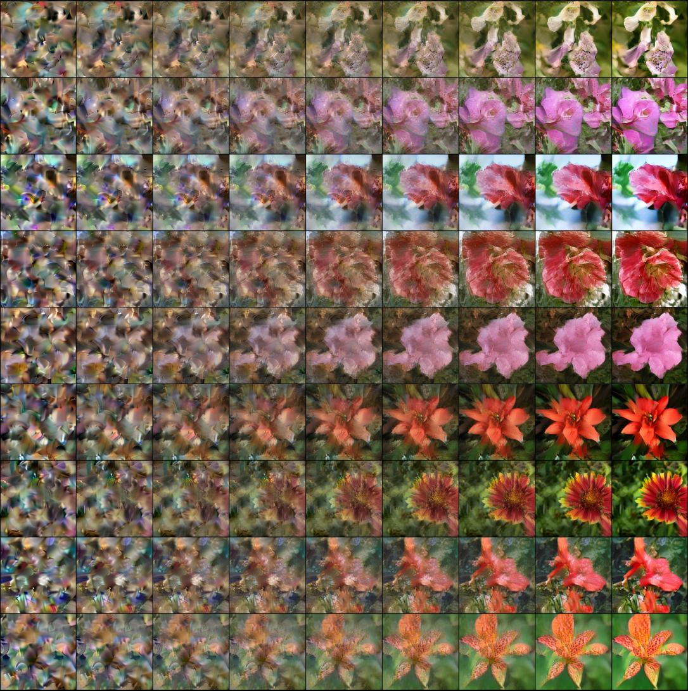
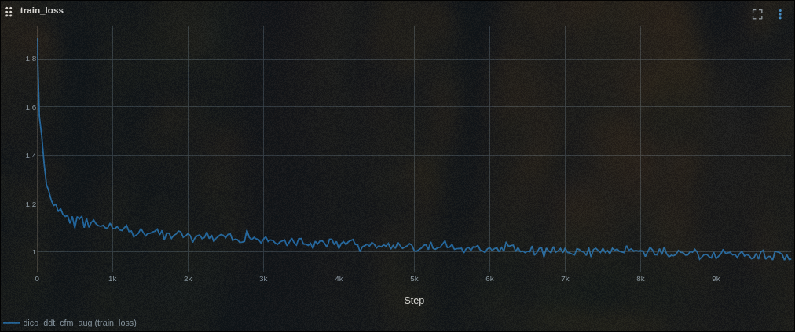

# Flow-Flowers: Class-to-Image Flow Matching on Oxford-102 🌸

## Project Scope

This project implements class-to-image generation using **flow matching with convolutions** (DiCo architecture & DDT improvement) with **contrastive flow matching** on the Oxford 102 Flowers dataset.

Key features include:

- Latent-space training via DC-AE autoencoder;
- Class-to-image conditional generation with CFG (torchdiffeq);
- Contrastive Flow Matching loss for better class separation;
- MLflow integration for experiment tracking;
- Terminal-based CLI workflow using Cyclopts;

> ⚠️ Note: The Jupyter notebooks are provided only for initial exploration and for viewing the resulting checkpoints. To run a training experiment you must use the provided CLI.

## 📦 Installation

```bash
uv sync --all-packages
```

**Key Dependencies:**

- PyTorch >=2.7.1
- Cyclopts (CLI framework)
- MLflow (experiment tracking)
- AlbumentationsX (augmentations)
- OmegaConf / Python-box (config management)

## 📂 Project Structure

```bash
flow_flowers/
├── src/
│   ├── flow_flowers/
│   │   ├── app.py         # CLI entry point
│   │   ├── config.py      # Configuration management
│   │   ├── data.py        # Dataset loading & preprocessing
│   │   ├── model.py       # AutoEncoder, DiCo & DDT architectures
│   │   ├── ode.py         # Euler ODE solver for sampling w/wo CFG
│   │   ├── param.py       # CLI Parameter management
│   │   ├── prob.py        # Optimal transport probability path
│   │   ├── train.py       # Trainer class with MLflow logging
│   │   └── utils.py       # Utility functions
├── notebook/
│   │   ├── viz_eda.ipynb  # Exploratory Data Analysis (EDA)
│   │   ├── viz_ode.ipynb  # Generating new samples using ODE solver
│   │   ├── viz_vae.ipynb  # Visualizing VAE latent space
│   │   └── viz_aug.ipynb  # Data Augmentation Visualization
├── README.md              # Project documentation
├── config.yaml            # Configuration file
└── pyproject.toml         # Build configuration
```

## 🌼 Dataset

The [Oxford Flowers-102](https://www.robots.ox.ac.uk/~vgg/data/flowers/102/) dataset contains:

- 8,189 images across **102 classes**
- Outliers with extreme aspect ratios
- Significant class imbalance (visualized in `viz_eda.ipynb`)

### Preprocessing

- DC-AE latent space encoding for diffusion training;
- Class embeddings implemented via `LabelEmbedder` layer;
- Random cropping and horizontal flips enabled via `get_transform()`;

## 🧠 Model Architecture

1. **DC-AE Autoencoder** (from SANA paper)

   - Used to compress images into 512x512 latents;
   - Registered buffers for mu/std normalization in `AutoEncoder`;

2. **DiCo & DDT Vector Field Model** (`model.py`)

```python
class DiCoDDT(nn.Module):
    def __init__(..., encoder=12, decoder=6, ...):
        # Encoder-decoder convolutional blocks with CCA
```

- 12-layer encoder / 6-layer decoder
- Channel-wise attention to reduce channel redundancy and improve local attention

3. **Contrastive Flow Matching** (`train.py`)

```python
loss_cfm = -self.cfm_w * F.mse_loss(v_pred, v_cfm)

# Creates negative class pairs using P^(N×N) sampling matrix
```

## ⚙️ Training Workflow

1. Configure experiments via `config.yaml` (see `workspaces/flow_flowers`)
2. Run training with Cyclopts CLI:

```bash
uv run python -m flow_flowers --config config.yaml

# Optional flags:
--ckpt-every=500   # Save checkpoints every N steps
--cfg=1.25         # Class guidance strength
```

3. Training features:

- Batched latent space optimization;
- MLflow logs for loss curves (see `Trainer.train_step()`);
- Augmentations prevent overfitting via random crops/flips;

## 📈 Results





**Key Observations:**

- Stable training at batch size=256, lr=1e-4
- Class imbalance impacts minority class generation quality
- Contrastive Flow Matching reduces FID by ~8.9 vs standard flow matching

## 📚 References

```bibtex
@misc{stoica2025contrastiveflowmatching,
title={Contrastive Flow Matching},
author={George Stoica and Vivek Ramanujan and Xiang Fan and Ali Farhadi and Ranjay Krishna and Judy Hoffman}}

@misc{ai2025dicorevitalizingconvnetsscalable,
title={DiCo: Revitalizing ConvNets for Scalable and Efficient Diffusion Modeling},
author={Yuang Ai et al.}}

@misc{wang2025ddtdecoupleddiffusiontransformer,
title={DDT: Decoupled Diffusion Transformer},
author={Shuai Wang et al.}}
```
